#### 大纲

* oc中对象的本质是什么
* 创建一个对象占用多少内存
* alloc和init分别是如何工作的
  * 如何定位到官方源码库
  * alloc 的三部曲
* 对象的种类有哪些
  * 实例对象（instance-class）
  * 类对象 （class）
  * 元类对象 （meta-class）
* isa 指针 （未完待续）
* 后续有时间会继续补充内容

#### OC中对象的本质

开发中编写的oc代码会先编译成c/c++,然后成汇编最后转成机器语言，`oc`→`c/c++`→`汇编`→`机器语言`。我们用创建一个**main.m**文件定义一个类`CWObject`：

```objective-c
interface CWObject: NSObject{}
@end
  
@implementation CWObject
@end
```

调用命令行`xcrun -sdk iphoneos clang -arch arm64 -rewrite-objc main.m`，将其编译成c/c++代码**main.cpp**.

```c++
struct CWObject_IMPL {
	struct NSObject_IMPL NSObject_IVARS;
};

struct NSObject_IMPL {
	Class isa;
};
```

可以看到OC中的**CWObject**在**main.cpp**中变成了**struct CWObject_IMPL**，所以oc中的对象本质上是结构体指针。

#### 创建一个对象占用多少内存
以NSObject为例

```objective-c
#import <Foundation/Foundation.h>
#import <objc/runtime.h>
#import <malloc/malloc.h>

NSObject *obj = [[NSObject alloc] init];
// 创建一个实例对象，需要的内存空间大小
NSLog(@"%zu", class_getInstanceSize([NSObject class]));	// 8
// 创建一个实例对象，操作系统实际分配的内存空间大小
NSLog(@"%zu", malloc_size((__bridge const void *)obj));	// 16
```

可以看出，创建一个实例对象**需要的内存大小**和**系统实际分配的大小**是有出入的。这里不一样的原因涉及到**内存对齐**问题。

#### alloc和init分别是如何工作的

```objective-c
NSObject *objc1 = [NSObject alloc];
```

如上代码，我们使用Xcode调试跟踪代码alloc，是定位不到源码的。因此通过这种方法我们并不能知道alloc内部做了些什么操作。所以我们需要一些方法来定位到源码。定位源码的方式有3种：
方法一：
* 先在alloc这一行打上断点
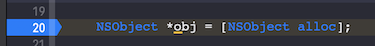
* 进入断点后，我们添加一个符号断点，操作如图：

* 
* 如图可以看到红框部分`libobjc.A.dylib`，这即是源码库.

方法二：
* 同方法一第一步类似，在alloc那一行打上断点，进入断点后按住`control`键后，点击下图红框部分
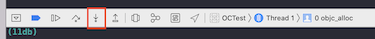
* 直到出现如下信息：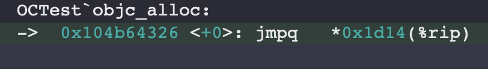
* 此时在打上一个符号断点，输入上图显示的`objc_alloc`.可以看到符号断点信息如图：后面的`libobjc`就是源码所在的库。

方法三：
* alloc打上断点后开启汇编调试
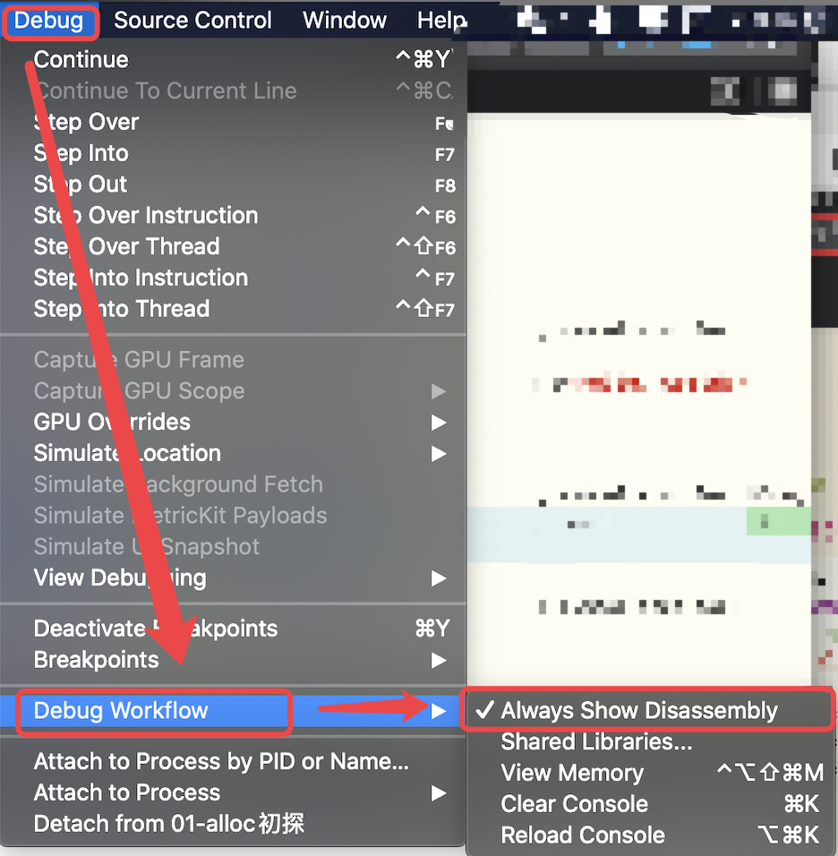
* 后面的步骤同方法二类似按住control，点击 step into 键，执行到下图的callq ，对应 objc_alloc
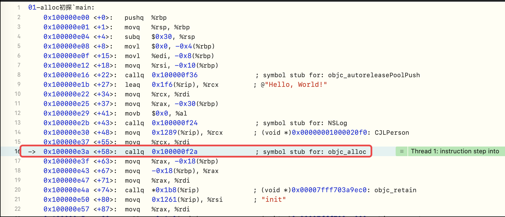
* 按住control，点击 step into 键进入，看到断点断在objc_alloc部分
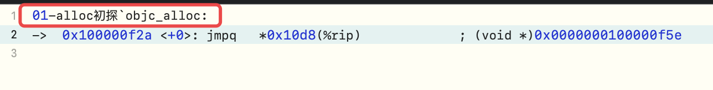
* 到了这一步就同方法二相同了，打上符号断点可知源码库在哪
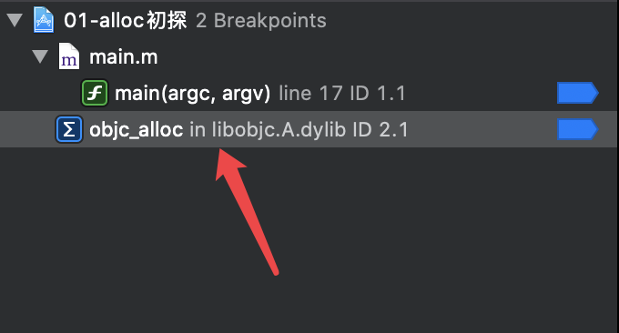
通过上面三种方式找到源码所在的库后，我们就可以在[Apple源码库](https://opensource.apple.com/tarballs/)上搜索并下载对应的源码了。

> 虽然找到了源码库，但是其实并不方便调试，如果我们能编译源码并直接通过control+cmd+左键可以直接跳转到对应的源码块就实在太方便了。可以参考此文[源码编译调试](https://juejin.im/post/6844904082226806792)

做完上面的准备工作之后，我们终于可以愉快的调试了。我们一层一层的点进去看源码.

调用alloc大致整个流程如下：
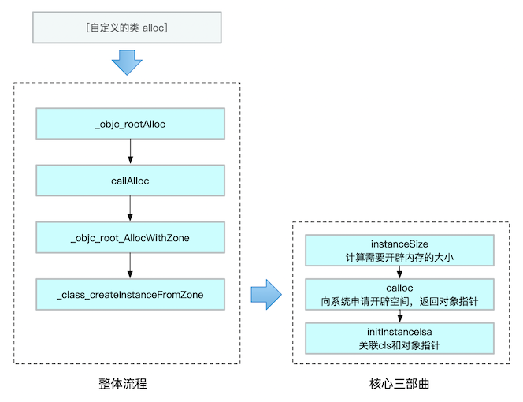
alloc之后调用init又做了哪些操作呢？我们先看一段代码：
```objective-c
LGPerson *p = [LGPerson alloc];
LGPerson *p1 = [p init];
LGPerson *p2 = [p init];
NSLog(@"%@ - %p", p, p);
NSLog(@"%@ - %p", p1, p1);
NSLog(@"%@ - %p", p2, p2);
```
控制台输出如下：
```
 <LGPerson: 0x100656990> - 0x100656990
 <LGPerson: 0x100656990> - 0x100656990
 <LGPerson: 0x100656990> - 0x100656990
```
p, p1, p2这三个指针指向的都是同一个地址。查看源码可以看到init并没有做其他额外操作，而是直接返回了self。
```
+ (id)init {
    return (id)self;
}

- (id)init {
    return _objc_rootInit(self);
}

id
_objc_rootInit(id obj)
{
    // In practice, it will be hard to rely on this function.
    // Many classes do not properly chain -init calls.
    return obj;
}
```
竟然init没有做任何操作，那么其存在的意义是什么呢。这里涉及到了工厂设计模式的思想。单纯的alloc并不能满足开发者的需求，我们平时需要大量的使用自定义的类去自定义构造方法，此时init就是官方暴露出来的自定义接口。这也是为什么我们重写构造方法都是重写init方法。
创建一个对象还可以使用new方法`LGPerson *p = [LGPerson new];`点进去源码如下：
```
+ (id)new {
    return [callAlloc(self, false/*checkNil*/) init];
}
```
new其实就是alloc和init的简写。但是new的弊端就是只会调用init方法，如果你自定义了类似`initWithXXXX`这样的构造方法是不会被new方法触发的。
#### OC中的对象的种类有哪些：

* 实例对象（instance）
* 类对象 （class）
* 元类对象 （meta-class）

##### 实例对象

我们使用**alloc**, **new**等方式创建出来的对象就是**实例对象**，他们各自有自己的内存空间。

```objective-c
NSObject *obj1 = [[NSObject alloc] init];
NSObject *obj2 = [[NSObject alloc] init];
```

obj1和obj2分别是两个不同的实例对象。一个实例对象在内存空间存储的信息有**isa指针**和**成员变量**：

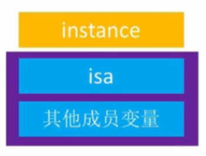

##### 类对象

当我们执行如下代码时：

```objective-c
NSObject *obj1 = [[NSObject alloc] init];
NSObject *obj2 = [[NSObject alloc] init];
NSLog(@"%p %p, %p, %p, %p,"
		obj1.class,
		obj2.class,
		object_getClass(obj1),
		object_getClass(obj2),
    [NSObject class]);

// log: 0x7fff94a14118 0x7fff94a14118, 0x7fff94a14118, 0x7fff94a14118, 0x7fff94a14118
```

可以发现同一个类创建的实例对象调用`class`或者`object_getClass`得到的对象都是同一个地址的对象。而这个对象就是**类对象**。`类对象是唯一的`。

类对象里存储的信息有**isa**指针，**superclass**指针，该类的成员变量信息，属性信息，实例方法信息，协议信息。

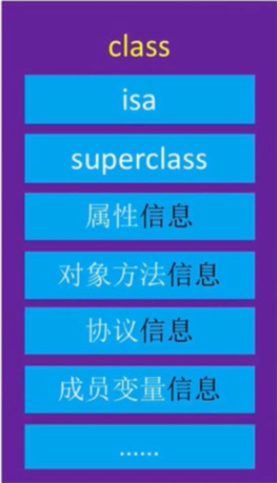

##### 元类对象

接下我们还是调用`object_getClass`,但是传入的不再是实例对象，而是类对象：

```objective-c
NSLog(@"%p", object_getClass([NSObject class]));// 这里传入类对象，看看得到了什么

// 控制台：0x7fff94a140f0
```

可以看到这次得到的是个新地址，**0x7fff94a140f0**和之前的类对象**0x7fff94a14118**是不同的地址。而这个新的对象就是**0x7fff94a14118**（meta-class）。

我们可以用`class_isMetaClass`来验证一下其是否是元对象：

```objective-c
Class meta = object_getClass([NSObject class]);
NSLog(@"%p", meta);
BOOL isMeta = class_isMetaClass(meta);
NSLog(@"is meta : %hhd", isMeta);

// 控制台log： 0x7fff94a140f0
// 控制台log： is meta: 1
```

**元类对象**和**类对象**的内存结构其实是一样的。在代码中他们都是用Class关键字来接收的。不同的是他们各自存储的主要信息不同。类对象存储的信息在上文中已经提到。元类对象主要存储的信息：**isa**指针，**superclass**指针，**类方法**信息。

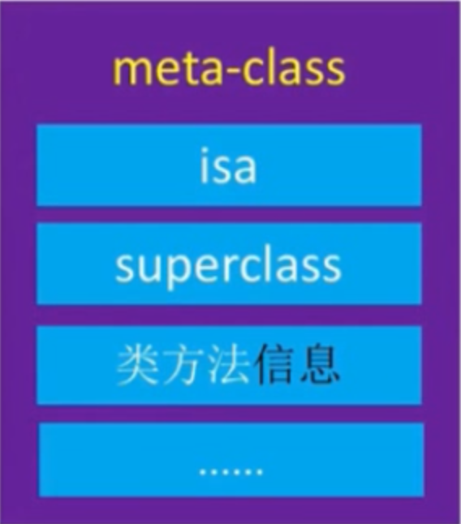

三种类型对象总览：
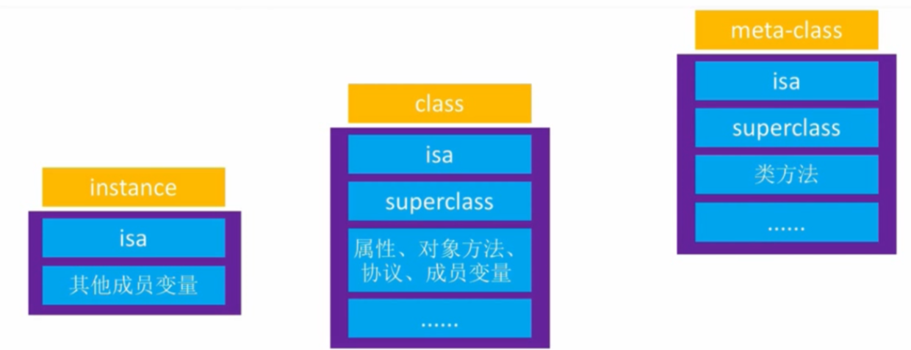

#### isa指针

实例对象，类对象，元类对象，他们都有一个**isa**指针，那么这个指针到底是指向哪里的呢。