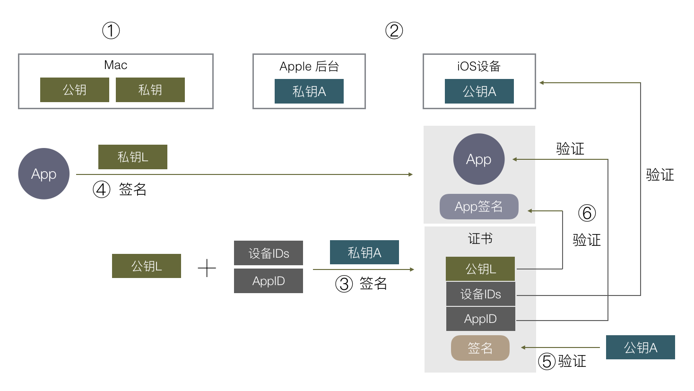

## **iOS App 签名的原理**

iOS 签名机制挺复杂，各种证书，Provisioning Profile，entitlements，CertificateSigningRequest，p12，AppID，概念一堆，也很容易出错，本文尝试从原理出发，一步步推出为什么会有这么多概念，希望能有助于理解 iOS App 签名的原理和流程。

## **目的**

先来看看苹果的签名机制是为了做什么。在 iOS 出来之前，在主流操作系统(Mac/Windows/Linux)上开发和运行软件是不需要签名的，软件随便从哪里下载都能运行，导致平台对第三方软件难以控制，盗版流行。苹果希望解决这样的问题，在 iOS 平台对第三方 APP 有绝对的控制权，一定要保证每一个安装到 iOS 上的 APP 都是经过苹果官方允许的，怎样保证呢？就是通过签名机制。

## **非对称加密**

通常我们说的签名就是数字签名，它是基于非对称加密算法实现的。对称加密是通过同一份密钥加密和解密数据，而非对称加密则有两份密钥，分别是公钥和私钥，用公钥加密的数据，要用私钥才能解密，用私钥加密的数据，要用公钥才能解密。

简单说一下常用的非对称加密算法 RSA 的数学原理，理解简单的数学原理，就可以理解非对称加密是怎么做到的，为什么会是安全的：

1. 选两个质数 p 和 q，相乘得出一个大整数n，例如 p = 61，q = 53，n = pq = 3233

2. 选 1-n 间的随便一个质数e，例如 e = 17

3. 经过一系列数学公式，算出一个数字 d，满足：

   a.通过 n 和 e 这两个数据一组数据进行数学运算后，可以通过 n 和 d 去反解运算，反过来也可以。

   b.如果只知道 n 和 e，要推导出 d，需要知道 p 和 q，也就是要需要把 n 因数分解。

上述的 (n,e) 这两个数据在一起就是公钥，(n,d) 这两个数据就是私钥，满足用私钥加密，公钥解密，或反过来公钥加密，私钥解密，也满足在只暴露公钥 (只知道 n 和 e)的情况下，要推导出私钥 (n,d)，需要把大整数 n 因数分解。目前因数分解只能靠暴力穷举，而 n 数字越大，越难以用穷举计算出因数 p 和 q，也就越安全，当 n 大到二进制 1024 位或 2048 位时，以目前技术要破解几乎不可能，所以非常安全。

若对数字 d 是怎样计算出来的感兴趣，可以详读这两篇文章：RSA 算法原理[（一）](http://www.ruanyifeng.com/blog/2013/06/rsa_algorithm_part_one.html)[（二）](http://www.ruanyifeng.com/blog/2013/07/rsa_algorithm_part_two.html)

## **数字签名**

现在知道了有非对称加密这东西，那数字签名是怎么回事呢？

数字签名的作用是我对某一份数据打个标记，表示我认可了这份数据（签了个名），然后我发送给其他人，其他人可以知道这份数据是经过我认证的，数据没有被篡改过。

有了上述非对称加密算法，就可以实现这个需求：

1. 首先用一种算法，算出原始数据的摘要。需满足 a.若原始数据有任何变化，计算出来的摘要值都会变化。 b.摘要要够短。这里最常用的算法是MD5。
2. 生成一份非对称加密的公钥和私钥，私钥我自己拿着，公钥公布出去。
3. 对一份数据，算出摘要后，用私钥加密这个摘要，得到一份加密后的数据，称为原始数据的签名。把它跟原始数据一起发送给用户。
4. 用户收到数据和签名后，用公钥解密得到摘要。同时用户用同样的算法计算原始数据的摘要，对比这里计算出来的摘要和用公钥解密签名得到的摘要是否相等，若相等则表示这份数据中途没有被篡改过，因为如果篡改过，摘要会变化。

之所以要有第一步计算摘要，是因为非对称加密的原理限制可加密的内容不能太大（不能大于上述 n 的位数，也就是一般不能大于 1024 位 / 2048 位），于是若要对任意大的数据签名，就需要改成对它的特征值签名，效果是一样的。

好了，有了非对称加密的基础，知道了数字签名是什么，怎样可以保证一份数据是经过某个地方认证的，来看看怎样通过数字签名的机制保证每一个安装到 iOS 上的 APP 都是经过苹果认证允许的。

## **最简单的签名**

要实现这个需求很简单，最直接的方式，苹果官方生成一对公私钥，在 iOS 里内置一个公钥，私钥由苹果后台保存，我们传 App 上 AppStore 时，苹果后台用私钥对 APP 数据进行签名，iOS 系统下载这个 APP 后，用公钥验证这个签名，若签名正确，这个 APP 肯定是由苹果后台认证的，并且没有被修改过，也就达到了苹果的需求：保证安装的每一个 APP 都是经过苹果官方允许的。

如果我们 iOS 设备安装 APP 只有从 AppStore 下载这一种方式的话，这件事就结束了，没有任何复杂的东西，只有一个数字签名，非常简单地解决问题。

但实际上因为除了从 AppStore 下载，我们还可以有三种方式安装一个 App：

1. 开发 App 时可以直接把开发中的应用安装进手机进行调试。
2. In-House 企业内部分发，可以直接安装企业证书签名后的 APP。
3. AD-Hoc 相当于企业分发的限制版，限制安装设备数量，较少用。

苹果要对用这三种方式安装的 App 进行控制，就有了新的需求，无法像上面这样简单了。

## **新的需求**

我们先来看第一个，开发时安装APP，它有两个个需求：

1. 安装包不需要传到苹果服务器，可以直接安装到手机上。如果你编译一个 APP 到手机前要先传到苹果服务器签名，这显然是不能接受的。

2. 苹果必须对这里的安装有控制权，包括

   a. 经过苹果允许才可以这样安装。

   b. 不能被滥用导致非开发app也能被安装。

为了实现这些需求，iOS 签名的复杂度也就开始增加了。

苹果这里给出的方案是使用了双层签名，会比较绕，流程大概是这样的：

1. 在你的 Mac 开发机器生成一对公私钥，这里称为**公钥L**，**私钥L**。L:Local
2. 苹果自己有固定的一对公私钥，跟上面 AppStore 例子一样，私钥在苹果后台，公钥在每个 iOS 设备上。这里称为**公钥A**，**私钥A**。A:Apple
3. 把公钥 L 传到苹果后台，用苹果后台里的私钥 A 去签名公钥 L。得到一份数据包含了公钥 L 以及其签名，把这份数据称为证书。
4. 在开发时，编译完一个 APP 后，用本地的私钥 L 对这个 APP 进行签名，同时把第三步得到的证书一起打包进 APP 里，安装到手机上。
5. 在安装时，iOS 系统取得证书，通过系统内置的公钥 A，去验证证书的数字签名是否正确。
6. 验证证书后确保了公钥 L 是苹果认证过的，再用公钥 L 去验证 APP 的签名，这里就间接验证了这个 APP 安装行为是否经过苹果官方允许。（这里只验证安装行为，不验证APP 是否被改动，因为开发阶段 APP 内容总是不断变化的，苹果不需要管。）

## **加点东西**

上述流程只解决了上面第一个需求，也就是需要经过苹果允许才可以安装，还未解决第二个避免被滥用的问题。怎么解决呢？苹果再加了两个限制，一是限制在苹果后台注册过的设备才可以安装，二是限制签名只能针对某一个具体的 APP。

怎么加的？在上述第三步，苹果用私钥 A 签名我们本地公钥 L 时，实际上除了签名公钥 L，还可以加上无限多数据，这些数据都可以保证是经过苹果官方认证的，不会有被篡改的可能。

可以想到把 允许安装的设备 ID 列表 和 App对应的 AppID 等数据，都在第三步这里跟公钥L一起组成证书，再用苹果私钥 A 对这个证书签名。在最后第 5 步验证时就可以拿到设备 ID 列表，判断当前设备是否符合要求。根据数字签名的原理，只要数字签名通过验证，第 5 步这里的设备 IDs / AppID / 公钥 L 就都是经过苹果认证的，无法被修改，苹果就可以限制可安装的设备和 APP，避免滥用。

## **最终流程**

到这里这个证书已经变得很复杂了，有很多额外信息，实际上除了 设备 ID / AppID，还有其他信息也需要在这里用苹果签名，像这个 APP 里 iCloud / push / 后台运行 等权限苹果都想控制，苹果把这些权限开关统一称为 Entitlements，它也需要通过签名去授权。

实际上一个“证书”本来就有规定的格式规范，上面我们把各种额外信息塞入证书里是不合适的，于是苹果另外搞了个东西，叫 Provisioning Profile，一个 Provisioning Profile 里就包含了证书以及上述提到的所有额外信息，以及所有信息的签名。

所以整个流程稍微变一下，就变成这样了：

因为步骤有小变动，这里我们不辞啰嗦重新再列一遍整个流程：

1. 在你的 Mac 开发机器生成一对公私钥，这里称为公钥L，私钥L。L:Local
2. 苹果自己有固定的一对公私钥，跟上面 AppStore 例子一样，私钥在苹果后台，公钥在每个 iOS 设备上。这里称为公钥A，私钥A。A:Apple
3. 把公钥 L 传到苹果后台，用苹果后台里的私钥 A 去签名公钥 L。得到一份数据包含了公钥 L 以及其签名，把这份数据称为证书。
4. 在苹果后台申请 AppID，配置好设备 ID 列表和 APP 可使用的权限，再加上第③步的证书，组成的数据用私钥 A 签名，把数据和签名一起组成一个 Provisioning Profile 文件，下载到本地 Mac 开发机。
5. 在开发时，编译完一个 APP 后，用本地的私钥 L 对这个 APP 进行签名，同时把第④步得到的 Provisioning Profile 文件打包进 APP 里，文件名为 embedded.mobileprovision，把 APP 安装到手机上。
6. 在安装时，iOS 系统取得证书，通过系统内置的公钥 A，去验证 embedded.mobileprovision 的数字签名是否正确，里面的证书签名也会再验一遍。
7. 确保了 embedded.mobileprovision 里的数据都是苹果授权以后，就可以取出里面的数据，做各种验证，包括用公钥 L 验证APP签名，验证设备 ID 是否在 ID 列表上，AppID 是否对应得上，权限开关是否跟 APP 里的 Entitlements 对应等。

开发者证书从签名到认证最终苹果采用的流程大致是这样，还有一些细节像证书有效期/证书类型等就不细说了。

## **概念和操作**

上面的步骤对应到我们平常具体的操作和概念是这样的：

1. 第 1 步对应的是 keychain 里的 “从证书颁发机构请求证书”，这里就本地生成了一对公私钥，保存的 CertificateSigningRequest 就是公钥，私钥保存在本地电脑里。
2. 第 2 步苹果处理，不用管。
3. 第 3 步对应把 CertificateSigningRequest 传到苹果后台生成证书，并下载到本地。这时本地有两个证书，一个是第 1 步生成的，一个是这里下载回来的，keychain 会把这两个证书关联起来，因为他们公私钥是对应的，在XCode选择下载回来的证书时，实际上会找到 keychain 里对应的私钥去签名。这里私钥只有生成它的这台 Mac 有，如果别的 Mac 也要编译签名这个 App 怎么办？答案是把私钥导出给其他 Mac 用，在 keychain 里导出私钥，就会存成 .p12 文件，其他 Mac 打开后就导入了这个私钥。
4. 第 4 步都是在苹果网站上操作，配置 AppID / 权限 / 设备等，最后下载 Provisioning Profile 文件。
5. 第 5 步 XCode 会通过第 3 步下载回来的证书（存着公钥），在本地找到对应的私钥（第一步生成的），用本地私钥去签名 App，并把 Provisioning Profile 文件命名为 embedded.mobileprovision 一起打包进去。这里对 App 的签名数据保存分两部分，Mach-O 可执行文件会把签名直接写入这个文件里，其他资源文件则会保存在 _CodeSignature 目录下。

第 6 – 7 步的打包和验证都是 Xcode 和 iOS 系统自动做的事。

这里再总结一下这些概念：

1. **证书**：内容是公钥或私钥，由其他机构对其签名组成的数据包。
2. **Entitlements**：包含了 App 权限开关列表。
3. **CertificateSigningRequest**：本地公钥。
4. **p12**：本地私钥，可以导入到其他电脑。
5. **Provisioning Profile**：包含了 证书 / Entitlements 等数据，并由苹果后台私钥签名的数据包。

## **其他发布方式**

前面以开发包为例子说了签名和验证的流程，另外两种方式 In-House 企业签名和 AD-Hoc 流程也是差不多的，只是企业签名不限制安装的设备数，另外需要用户在 iOS 系统设置上手动点击信任这个企业才能通过验证。

而 AppStore 的签名验证方式有些不一样，前面我们说到最简单的签名方式，苹果在后台直接用私钥签名 App 就可以了，实际上苹果确实是这样做的，如果去下载一个 AppStore 的安装包，会发现它里面是没有 embedded.mobileprovision 文件的，也就是它安装和启动的流程是不依赖这个文件，验证流程也就跟上述几种类型不一样了。

据猜测，因为上传到 AppStore 的包苹果会重新对内容加密，原来的本地私钥签名就没有用了，需要重新签名，从 AppStore 下载的包苹果也并不打算控制它的有效期，不需要内置一个 embedded.mobileprovision 去做校验，直接在苹果用后台的私钥重新签名，iOS 安装时用本地公钥验证 App 签名就可以了。

那为什么发布 AppStore 的包还是要跟开发版一样搞各种证书和 Provisioning Profile？猜测因为苹果想做统一管理，Provisioning Profile 里包含一些权限控制，AppID 的检验等，苹果不想在上传 AppStore 包时重新用另一种协议做一遍这些验证，就不如统一把这部分放在 Provisioning Profile 里，上传 AppStore 时只要用同样的流程验证这个 Provisioning Profile 是否合法就可以了。

所以 App 上传到 AppStore 后，就跟你的 证书 / Provisioning Profile 都没有关系了，无论他们是否过期或被废除，都不会影响 AppStore 上的安装包。

到这里 iOS 签名机制的原理和主流程大致说完了，希望能对理解苹果签名和排查日常签名问题有所帮助。

## **P.S.一些疑问**

最后这里再提一下我关于签名流程的一些的疑问。

### **企业证书**

[企业证书签名因为限制少，在国内被广泛用于测试和盗版，fir.im](http://企业证书签名因为限制少，在国内被广泛用于测试和盗版，fir.im) / 蒲公英等测试平台都是通过企业证书分发，国内一些市场像 PP 助手，爱思助手，一部分安装手段也是通过企业证书重签名。通过企业证书签名安装的 App，启动时都会验证证书的有效期，并且不定期请求苹果服务器看证书是否被吊销，若已过期或被吊销，就会无法启动 App。对于这种助手的盗版安装手段，苹果想打击只能一个个吊销企业证书，并没有太好的办法。

这里我的疑问是，苹果做了那么多签名和验证机制去限制在 iOS 安装 App，为什么又要出这样一个限制很少的方式让盗版钻空子呢？若真的是企业用途不适合上 AppStore，也完全可以在 AppStore 开辟一个小的私密版块，还是通过 AppStore 去安装，就不会有这个问题了。

### **AppStore 加密**

另一个问题是我们把 App 传上 AppStore 后，苹果会对 App 进行加密，导致 App 体积增大不少，这个加密实际上是没卵用的，只是让破解的人要多做一个步骤，运行 App 去内存 dump 出可执行文件而已，无论怎样加密，都可以用这种方式拿出加密前的可执行文件。所以为什么要做这样的加密呢？想不到有什么好处。

### **本地私钥**

我们看到前面说的签名流程很绕很复杂，经常出现各种问题，像有 Provisioning Profile 文件但证书又不对，本地有公钥证书没对应私钥等情况，不理解原理的情况下会被绕晕，我的疑问是，这里为什么不能简化呢？还是以开发证书为例，为什么一定要用本地 Mac 生成的私钥去签名？苹果要的只是本地签名，私钥不一定是要本地生成的，苹果也可以自己生成一对公私钥给我们，放在 Provisioning Profile 里，我们用里面的私钥去加密就行了，这样就不会有 CertificateSigningRequest 和 p12 的概念，跟本地 keychain 没有关系，不需要关心证书，只要有 Provisioning Profile 就能签名，流程会减少，易用性会提高很多，同时苹果想要的控制一点都不会少，也没有什么安全问题，为什么不这样设计呢？

能想到的一个原因是 Provisioning Profile 在非 AppStore 安装时会打包进安装包，第三方拿到这个 Provisioning Profile 文件就能直接用起来给他自己的 App 签名了。但这种问题也挺好解决，只需要打包时去掉文件里的私钥就行了，所以仍不明白为什么这样设计。