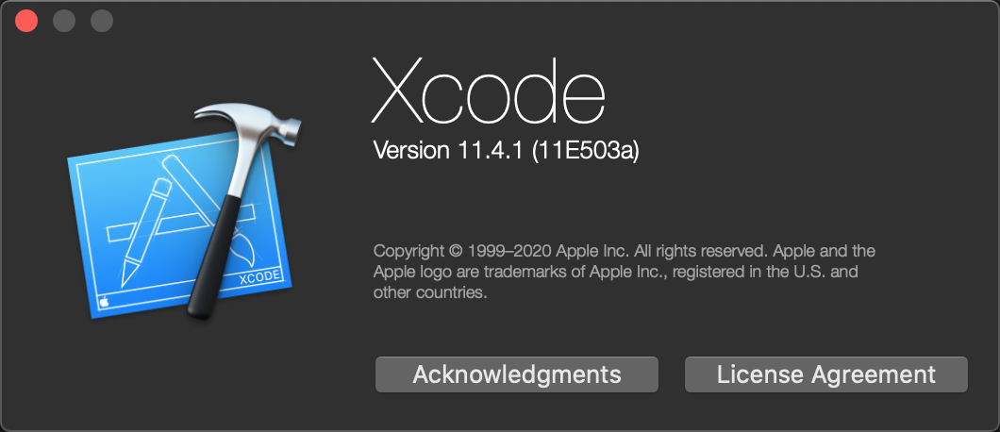
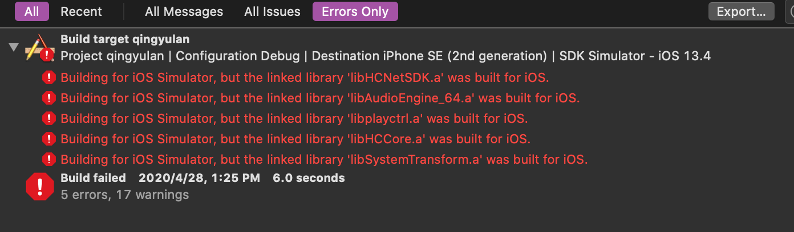
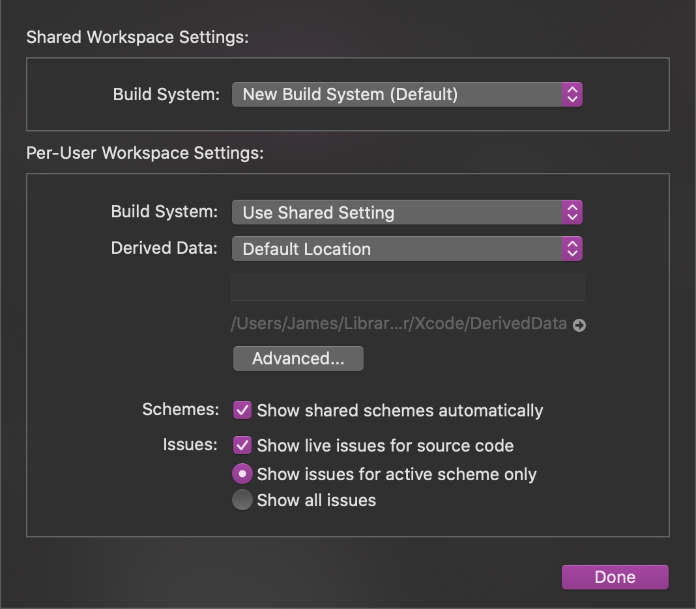
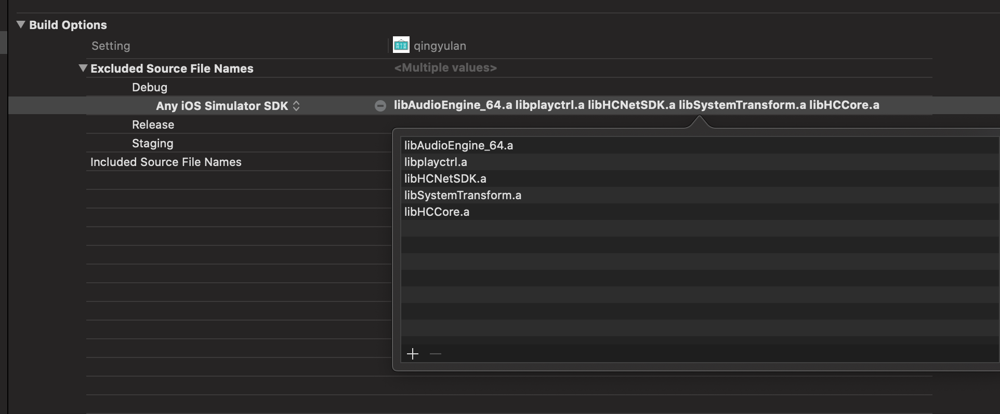

## [解决 Xcode 11.4 以来模拟器编译报错 Building for iOS Simulator, but the linked library was built for iOS 的正确姿势](https://blog.lessney.com/blog/2020/05/22/解决-Xcode-11-4-以来模拟器编译报错-Building-for-iOS-Simulator-but-the-linked-library-was-built-for-iOS-的正确姿势/)


## 我们遇到的问题



升级 Xcode 11.4 之后，我们原先的项目无法在模拟器上运行了，因为我们的项目里使用了一些第三方的 SDK，这些 SDK 仅支持在设备上运行，并没有编译对 iOS Simulator 的支持，这下好了，在更新了新的 Xcode 后， 默认已经无法编译链接通过了，报错信息： Building for iOS Simulator, but the linked library was built for iOS。



对此，苹果员工 edford 给出的答案是：

Having x86_64 code is not sufficient to distinguish if a binary is intended for the iOS Simulator, a macOS app, or a Mac Catalyst app. Combing built binaries across different destinations (which includes the simulator vs. device binaries) is not a supported combination – there is no Apple platform where ARM code and x86_64 code in the same binary is a correct configuration.

If this is your library, you should have your app build it from source as a dependency of your Xcode project, either through an Xcode target or through Swift Package Manager, so that the right platform information is included based on the build target.

If this is your library but you have a specific reason for it to be pre-compiled, please build it as an XCFramework. XCFrameworks correctly separate out binaries that have the right architectures for the different platforms you target. In addition to instructions on how to build such a XCFramework linked earlier, we have a WWDC talk illustrating it.

If this library is from a framework vendor (either as source or a pre-compiled binary), or you integrate a vendor’s library into your app with a third party dependency manager, please consult with the library vendor or dependency manager for support.

原文链接如下：https://forums.developer.apple.com/thread/130684

Apple 让我们重新编译这些 SDK 以支持 `iOS Simulator`，如果我们使用的第三方的 SDK，请联系第三方以提供技术支持，这显然不是我们想要的。一方面，一些年代久远的 SDK 已经找不到维护人员，另一方面有些 SDK 仅提供设备的支持也是合理的，毕竟它们本身就无法在模拟器上正确运行，因为它们依赖于硬件设备。

针对这个问题，有人给出了两个解决方案：

## 方案一

修改Workspaces Setting

```
File`–>`Workspaces Setting`–>`Legacy Build System
```



这个方案是让我们回到旧的编译🧬系统，这不是我们想要的…

## 方案二 (推荐姿势)

```
debug模式`忽略`.a`或者`framework
```

在`build Setting`–> `EXCLUDED_SOURCE_FILE_NAMES`



并且在引用地方用宏来判断非模拟器的情况:

```
  BASH1#if !TARGET_IPHONE_SIMULATOR2#endif
```

这个方案看起来优雅多了，对，就这么干了！