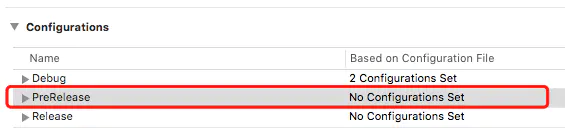

## 环境变量配置

## 1. 前言

#### 1.1 开发中遇到需要来回切换环境或者配置参数的问题

1. 平时我们做项目开发的时候最常用的就是**Debug**模式和**Release**模式了.
2. 涉及网络请求的时候,服务器最基本的也会有**"测试环境地址"**和**"正式环境地址"**.
3. 当我们有用到**三方的一些SDK**的时候,需要各种**配置参数**就更不要说了.比如极光推送是**debug模式**还是**release模式**;三方分享登录等,开发的时候可能用的是**开发人员自己的账号**申请的参数,发布的时候需要改成**公司的账号**申请的参数等等等...

> 在项目开发中类似的场景实在有太多,上面所提及情况,相信就算你的公司开发团队再如何不专业也应该是会遇到的.

#### 1.2 手动改动代码解决方式

对于1.1中所提及的问题,我之前一直是手动改代码解决的.比如切换网络环境(以oc代码为例)

1. 写2个同名的宏,用到哪一个就注释掉另一个


```cpp
#define BaseUrl @"我是测试服务器地址"
//#define BaseUrl @"我是正式服务器地址"
```

1. 或者用宏来判断


```cpp
#if 1
#define BaseUrl @"我是测试服务器地址"
#else
#define BaseUrl @"我是正式服务器地址"
#endif
```

- 这样做的缺点显而易见,每次更换都需要人为的去改动代码.十分耗费精力.而且一般像这样的全局的宏都定义在某个配置.h文件中.而我们又可能将这个.h文件引入到了.pch文件中.所以每一次的更改,Xcode重新编译的时间会很长.很影响项目的开发效率.
- 终于某一天我受够了这样 low 13 的方式了 -_-* 不在懒惰中爆发就在懒惰中灭亡.难道就没有什么一劳永逸的方法么.每次的手动更改我实在受不啦.
- 于是在私下抽空充电之余,就有了这篇总结文章.一方面是自己技术点的积累和记录,方便以后自己回顾,另一方面是希望能够给与同样处境的人带去一丝帮助.

## 2. scheme相关设置

在进入正题之前先说一下scheme这个东西,理论就不说了.我喜欢直接操作和撸代码.当你会用了再回头去看那些理论你才会容易理解,否则用都没用,直接看到那些纯理论的字眼我就,唉呀妈呀脑瓜疼,脑瓜疼,脑瓜疼~~~

#### 2.1 编辑 scheme

开发人员在运行代码的时候需要切换环境,比如Xcode默认是debug模!
式,只有archive时才是默认release的包.如果需要开发编译的时候切成release模式,可以通过编辑scheme来实现


步骤一.png


步骤二.png


步骤三.png

#### 2.2 新建 scheme

切换环境的时候,我们还是需要手动编辑scheme.如果不想这么做.我们可以选择(图步骤二)中下面的那个**new schemes**选项,新建一个scheme并设置好它的build Configuration.之后的使用只用来回切换scheme就可以了.需要用到哪个环境就选择对应的scheme来cmd + r 就好了.


图一.png

#### 2.3 新建 Build Configuration

- 在实际开发中我们常常需要区分不同的环境，上面是以最简单的开发与生产环境为例.但实际情况是根据不同公司的开发流程,是会有不同的多个环境,比如有些公司在开发环境和生产环境之间会有一个预发布的流程环境.
- 这时我们可以自己创建一个
- oc和swift有些地方不一样,这里分开说明,步骤如下:

##### 2.3.1 如果你是OC项目:

1. 选中 工程->Project->Info 后,我们可以看到有一栏Configurations

   

   图二.png

   图中红框部分就是我们的环境,可以看到Debug,Release本来就有的.我们需要新建的话就点击箭头指向的加号+后,一般选则第一个带有debug字眼的那个选项.至于为什么这里不做赘述,请自行了解.

2. 比如我新建了一个预发布的环境,取名为preRelease

   

   图三

3. 这时我们回到2.1中描述的步骤,选中scheme编辑会发现build Configuration中除了之前就有的Debug和Release多了一个preRelease选项

   

   图四

4. 然后我们点击工程->Project->Build Setting->Preprocessor Macros查看会发现,多了一个PreRelease选项,这里我们可以定义一些预编译宏处理.后面的DEBUG=0 和 PRERELEASE=1就是我自定义的:

   

   图五

   在代码中我们就可以这么使用:


```cpp
#if PRERELEASE
    NSLog(@"预发布版本");
#elif DEBUG
    NSLog(@"开发环境");
#else
    NSLog(@"生产环境");
#endif
```

更高阶的用法可以涉及 && 和 || 的配合使用,这不是本文重点,请自行充电 ~_~

##### 2.3.2 如果你是swift项目:

- 除了最后一步不同,其他步骤请参考上文.直接说下最后一步

- 我们新建好了一个新的Build Configuration后,同样的在Preprocessor Macros中也出现了新的配置选项,如图:

  

  图六

  但是像oc项目那样设置是没有用的,即使你改掉了PreRelease=1也是没用的.以下代码中的第一个 if 始终不会进入:


```bash
        #if PreRelease
            print("PreRelease")
        #elseif DEBUG
            print("DEBUG")
        #else
            print("release")
        #endif
```

- 原因是因为swift摒弃了oc那样的不安全预编译宏功能.只保留了部分基本的用法.不过上面的问题还是可以解决的.

- 点击 工程->Project->Build Setting -> Active Compilation Conditions 如图

  

  图七

  上图红框的部分可以自己命名,一般写成对应环境名称的大写.这个配置只有Xcode8以上才有.(现在应该没有人还在用低于这个版本的编译器吧-_-).

- 还有一种配置方式 工程->Project -> build setting -> other swift flags

  

  图八

  和上面一样,红框部分名字自己取名,不过需要在前面加上-D.

- 以上两种配置方式根据个人喜好二选一

- 这样的弄完之后,切换到preRelease环境后上面那段代码的第一个 if 语句就能执行了.

## 3. xcconfig文件的使用

> 上面铺垫了那么多,终于进入正题了.下面就来说下xcconfig文件的使用.

正如开篇说的那样,像那些需要视环境而定的一些配置参数.我们可以把他们都定义在xcconfig文件中.然后为每一个环境配置一个xcconfig文件.这样切环境之后,对应的需要更改的数据都会自动更换,省去了开发人员手动修改的步骤.

#### 3.1 如果你是OC项目

##### 3.1.1 xcconfig文件的创建


图九


示例代码中我创建了2个配置文件:


图十

##### 3.1.2 xcconfig文件的关联

创建好了配置文件,接下来就是将其和项目环境关联起来
点击工程 -> Project -> Info -> Configuration

应该是篇幅太长了,后面其实还有很多,发布的时候不知道为什么后面的内容都没了. 准备另开一篇文章了. 妈个鸡 -_-!!


##### 3.1.2 xcconfig文件的关联

创建好了配置文件,接下来就是将其和项目环境关联起来
点击工程 -> Project -> Info -> Configuration


1.png

##### 3.1.3 xcconfig文件的编辑以及代码中对其内容的使用

这里还是以不同运行环境下服务器地址不同为例:

- DEBUG环境对应的Config.xcconfig文件内容如下:


```jsx
GCC_PREPROCESSOR_DEFINITIONS = $(inherited) Base_Url='$(Base_Url)'
Base_Url = @"我是测试版本地址"
```

- PreRelease环境对应的Config2.xcconfig文件内容如下:


```jsx
GCC_PREPROCESSOR_DEFINITIONS = $(inherited) Base_Url='$(Base_Url)'
Base_Url = @"我是预测试版本地址"
```

- 两个配置文件我都定义了一个Base_Url. 第一行 GCC_PREPROCESSOR_DEFINITIONS 是固定写法,其作用是将文件里面定义的字段变成预编译的宏,这样我们在代码中就可以直接访问配置文件里面字段对应的值.
- 代码中使用如下:


```objectivec
- (void)viewDidLoad {
    [super viewDidLoad];
    NSLog(@"%@", Base_Url);
}
```

- 直接访问即可,编译器会根据当前的运行环境获取到其对应的值.妈妈再也不担心我们需要写环境判断的代码了.所以这里不同的运行环境,log打印出的base_url的值是不一样的.

#### 3.2 如果你是swift项目

前面的所有步骤同OC项目无异.也最后一步有差异.


2.png

- 同上.新建了2个配置文件并关联对应的运行环境后,内容分别如下:


```cpp
// DebugConfig.xcconfig
Base_url = 我是测试地址
```


```cpp
// PreReleaseConfig.xcconfig
Base_url = 我是预发布地址
```

- 你会发现我并没有添加 GCC_PREPROCESSOR_DEFINITIONS, 因为swift是不支持宏编译的.所以加了也不会有效果.也就是说我们在xcconfig中添加的字段,并不能通过代码直接获取.

- 这里我采取的是借用了系统Info.plist来访问的,如果你有更好的方法,还请不吝赐教.

- 我在plist里面添加了一个类型为Dictionary的Config字段,如下图:

  

  3.png

- 然后将配置文件中的字段迁移到Config中: 格式为 key = 字段名, value = ${字段名}, 如下图:

  

  4.png

- 最后我们就能够通过代码来读取config中的内容了,代码如下:


```jsx
if let info = Bundle.main.infoDictionary, let config = info["Config"] as? Dictionary<String, Any>
        {
            let base_url = config["Base_url"]
            print("\(base_url!)")
        }
```

- 这样就能过根据不同的运行环境获取到不同的base_url.同OC项目效果一样,不需要再添加手动判断的代码了.当然实际项目中读取config的这一部分逻辑可以封装一下,方便在项目中使用和查看.这里不做示范.

至此,文章over !!