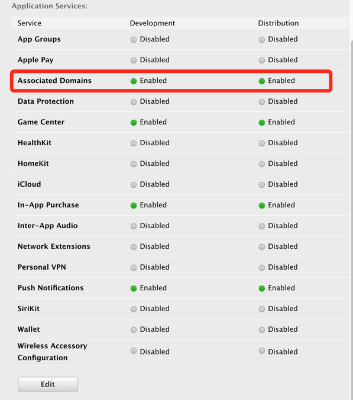
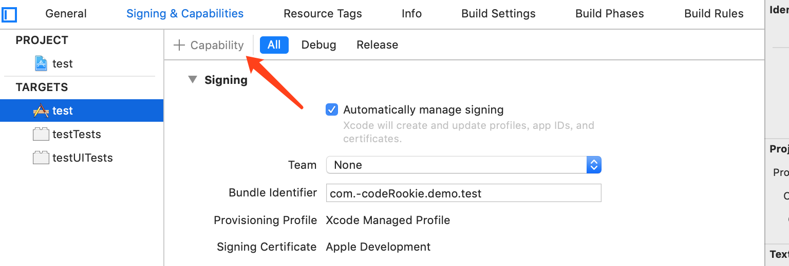
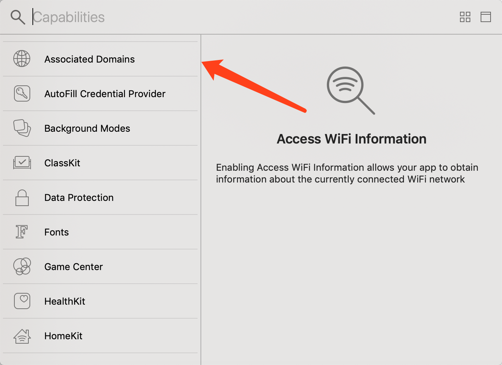
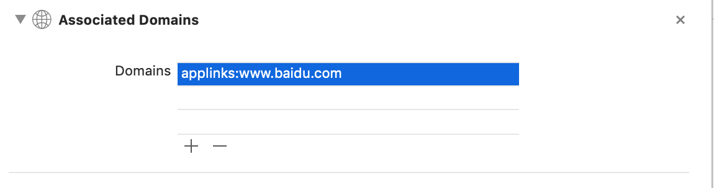
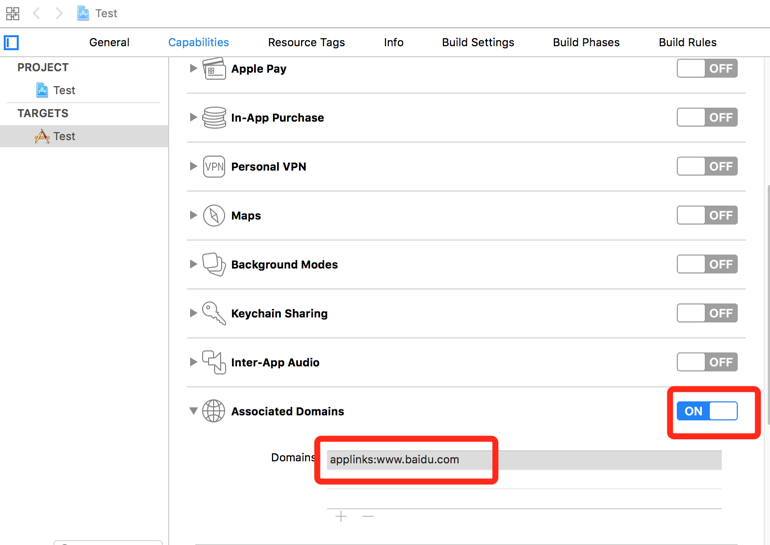
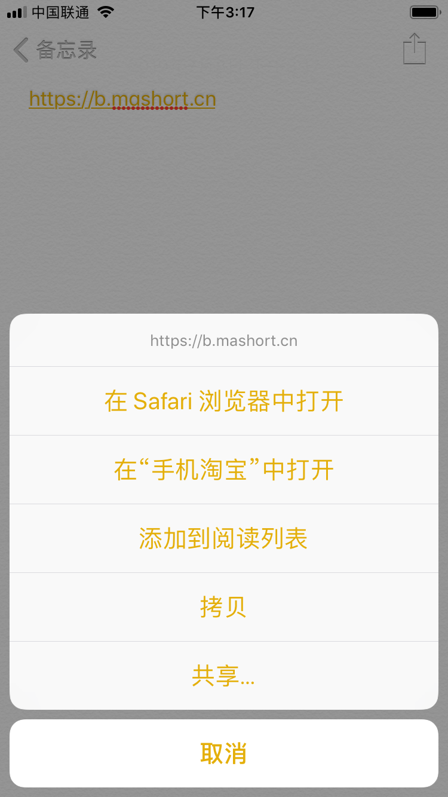
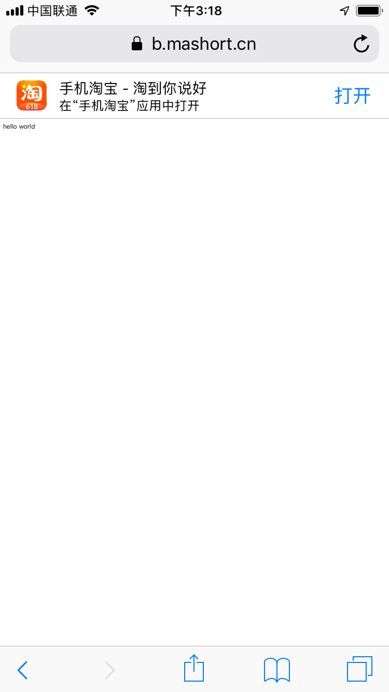
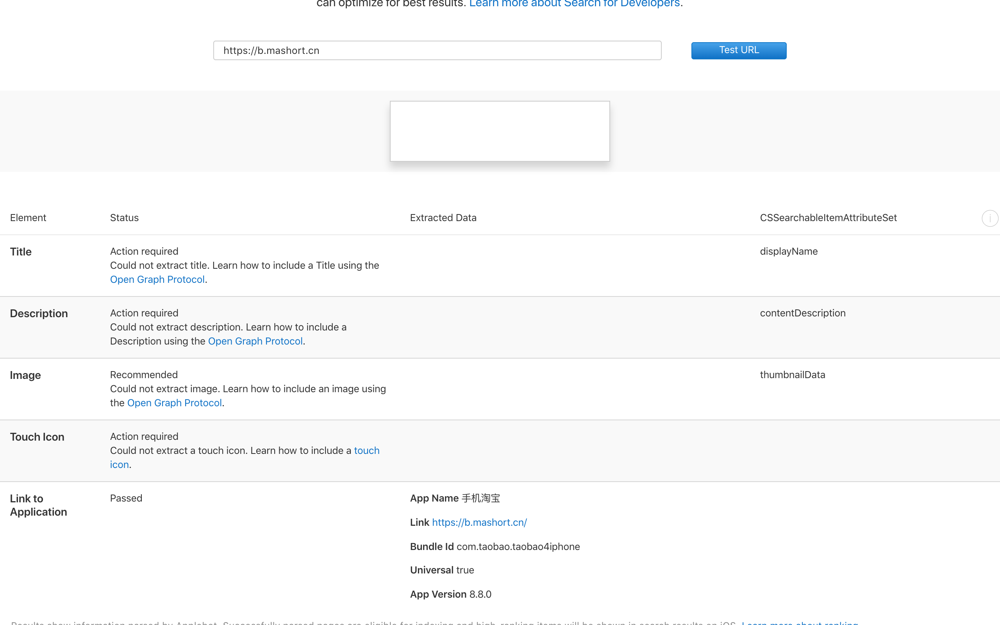

[iOS 唤起APP之Universal Link(通用链接)](https://www.cnblogs.com/guoshaobin/p/11164000.html)

- 包含Xcode11.0的配置方式和iOS13出现的问题。

#### 什么是`Universal Link`(通用链接)

`Universal Link`(通用链接)是Apple在iOS9推出的一种能够方便的通过传统`HTTPS`链接来启动APP的功能，可以使用相同的网址打开网址和APP。当你的应用支持`Universal Link`(通用链接)，当用户点击一个链接是可以跳转到你的网站并获得无缝重定向到对应的APP，且不需要通过`Safari`浏览器。如果你的应用不支持的话，则会在`Safari`中打开该链接。在苹果开发者中可以看到对它的介绍是：

> Seamlessly link to content inside your app, or on your website in iOS 9 or later. With universal links, you can always give users the most integrated mobile experience, even when your app isn’t installed on their device.

#### 如何理解`Universal Link`(通用链接)

`Universal Link`(通用链接)：看起来就是一条普通的`https`链接，当然是我们在该链接域名根目录配置过的一个链接，也可以在该链接中放置对应的H5页面。当用户的点击该链接，只要手机中安装了支持该链接的APP就会直接进入到APP中。如果没有安装APP则会跳转到`Safari`浏览器中，展示H5页面。对用户来说则是一个无缝跳转的过程。

#### `Universal Link`(通用链接)的应用场景

使用`Universal Link`(通用链接)可以让用户在`Safari`浏览器或者其他APP的`webview`中拉起相应的APP，也可以在APP中使用相应的功能，从而来把用户引流到APP中。比如淘宝当在`Safari`浏览器中进入淘宝网页点击打开APP则会使用`Universal Link`(通用链接)来拉起淘宝APP。

#### 使用`Universal Link`(通用链接)跳转的好处

- **唯一性**: 不像自定义的`URL Scheme`，因为它使用标准的`HTTPS`协议链接到你的web站点，所以一般不会被其它的APP所声明。另外，`URL scheme`因为是自定义的协议，所以在没有安装 app 的情况下是无法直接打开的(在`Safari`中还会出现一个不可打开的弹窗)，而`Universal Link`(通用链接)本身是一个`HTTPS`链接，所以有更好的兼容性；
- **安全**:当用户的手机上安装了你的APP，那么系统会去你配置的网站上去下载你上传上去的说明文件(这个说明文件声明了当前该`HTTPS`链接可以打开那些APP)。因为只有你自己才能上传文件到你网站的根目录，所以你的网站和你的APP之间的关联是安全的；
- **可变**:当用户手机上没有安装你的APP的时候，`Universal Link`(通用链接)也能够工作。如果你愿意，在没有安装你的app的时候，用户点击链接，会在safari中展示你网站的内容；
- **简单**:一个`HTTPS`的链接，可以同时作用于网站和APP；
- **私有**: 其它APP可以在不需要知道你的APP是否安装了的情况下和你的APP相互通信。

#### 支持`Universal Link`(通用链接)

1. 先决条件:必须有一个支持`HTTPS`的域名，并且拥有该域名下的上传到根目录的权限（为了上传Apple指定文件）。

2. 开发者中心配置：找到对应的App ID，在Application Services列表里有Associated Domains一条，把它变为Enabled就可以了。

   配置App ID支持Associated Domains:
   

3. 工程配置：

   - **Xcode 11.0版本**
     工程配置中相应功能：targets->Signing&Capabilites->Capability->Associated Domains，在其中的Domains中填入你想支持的域名，也必须必须以applinks:为前缀。
     具体步骤如下图:
     
     
     
   - Xcode 11.0以下版本 
     工程配置中相应功能：targets->Capabilites->Associated Domains，在其中的Domains中填入你想支持的域名，必须以applinks:为前缀。
     配置项目中的Associated Domains:
     

4. 配置指定文件：创建一个内容为json格式的文件，苹果将会在合适的时候，从我们在项目中填入的域名请求这个文件。这个文件名必须为apple-app-site-association，**切记没有后缀名**，文件内容大概是这样子：

   ```json
   {
       "applinks": {
           "apps": [],
           "details": [
               {
                   "appID": "9JA89QQLNQ.com.apple.wwdc",
                   "paths": [ "/wwdc/news/", "/videos/wwdc/2015/*"]
               },
               {
                   "appID": "ABCD1234.com.apple.wwdc",
                   "paths": [ "*" ]
               }
           ]
       }
   }
   ```

   说明：

   > appID：组成方式是 `teamId.yourapp’s bundle identifier`。如上面的 9JA89QQLNQ就是teamId。登陆开发者中心，在Account -> Membership里面可以找到Team ID。

   > paths：设定你的app支持的路径列表，只有这些指定的路径的链接，才能被app所处理。星号的写法代表了可识 别域名下所有链接。

5. 上传指定文件:上传该文件到你的域名所对应的根目录或者.well-known目录下，这是为了苹果能获取到你上传的文件。上传完后,自己先访问一下,看看是否能够获取到，当你在浏览器中输入这个文件链接后，应该是直接下载apple-app-site-association文件。

#### `Universal Link`(通用链接)相关验证

在iOS设备中的备忘录中输入APP能识别的链接，然后直接点击此链接，就会直接跳转到你的app了。或是长按，在出现的弹出菜单中第二项是在’XXX’中打开，这也代表着成功：

或是你将要测试的网址在`Safari`中打开，在出现的网页上方下滑，可以看到有在”XX”应用中打开：

出现菜单:


当点击某个链接，直接可以进我们的app了，但是我们的目的是要能够获取到用户进来的链接，根据链接来展示给用户相应的内容。
我们需要在工程里的实现`AppDelegate`里对应的方法：

```objectivec
- (BOOL)application:(UIApplication *)application continueUserActivity:(NSUserActivity *)userActivity restorationHandler:(void (^)(NSArray * _Nullable))restorationHandler {
    if ([userActivity.activityType isEqualToString:NSUserActivityTypeBrowsingWeb])
    {
        NSURL *url = userActivity.webpageURL;
        if (url是我们希望处理的)
        {
            //进行我们的处理
        }
        else
        {
            [[UIApplication sharedApplication] openURL:url];
        }
    }
     
    return YES;
}
```

苹果为了方便开发者，提供了一个[网页来验证](https://search.developer.apple.com/appsearch-validation-tool/)我们编写的这个apple-app-site-association是否合法有效，进入验证网址进行验证：


**注意**
前端开发经常面临跨域问题，必须要求跨域，如果不跨域，就不行。
只有当前`webview`的`URL`域名，与跳转目标`URL`域名不一致时，`Universal Link`(通用链接)才生效。

#### 问题汇总

- **按照上面写的配好了，怎么死活打不开呀？？？**

  1. 支持HTTPS呀，一定要是符合苹果认证的HTTPS证书呀。
  2. 系统问题，确保iOS9.0以上
  3. 配置文件问题，apple-app-site-association文件中配置的path和测试用的通用链接不一致，注意是区分大小写的。
  4. 域名问题，Xcode中配置的域名一不小心写错了。

- **为毛有的手机成功了，有的手机就不行呢？？？**

  1. 上面也提到过，因为网络波动有可能会导致部分用户第一次安装时，无法下载apple-app-site-association文件，这个只能引导用户删除重装或者在迭代时修改Associated Domains配置告诉系统重新下载apple-app-site-association文件。
  2. 另外一种可能是苹果抽风导致，笔者今年年初一碰到过一个蛋疼的问题，从中午一直到下午4点发现重复的删除重装，app也不会请求服务器的apple-app-site-association文件，过了4点之后就好了。当时因为时间特殊并没有深究到底是什么原因导致。

- **服务器换域名了肿么办？？？**
  当Associated Domains添加新的 Domains的之后，在app再次启动的时候抓包发现（不需要删除重装），苹果会给新添加的这个Domains发送一个请求，请求新Domain下的apple-app-site-association文件。

  也就是说Associated Domains发生改变的话，系统是会知道的，这样就可以在迭代的时候删除旧的域名，添加新的域名了。
  另外Domains的配置也可以使用通配符，例如：`applinks:*.mywebsite.com`

- **全都配置好了，项目也能唤起来了，web页面到底该怎么弄呀？？？通用链接指向的服务器的页面到底应该是哪个？**

  之前iOS和安卓用的是同一个网页，也就是说从APP内分享出去的网页，可以被苹果用户和安卓用户同时查看，在这里需要由web童鞋使用js判断当前所处的平台以及其系统。

  如果是安卓用户，则显示安卓相关提示页面。

  如果是苹果用户，那么分两种：

  1. 如果是9.0以上的系统，相关的“在APP内打开”按钮的链接配置的就是我们的`Universal Link`(通用链接)了，且该通用链接地址指向的是一个APP下载引导页面，那么当用户安装了APP，即可通过通用链接唤醒APP；如果用户没有安装app，那么就会跳转到通用链接指向的APP下载引导页面，达到最大化的客户导流。
  2. 如果是9.0以下的系统，则相应的 “在APP内打开”的按钮就会发一个跳转到我们APP `URL Scheme`的重定向，以实现在`Safari`中唤醒我们的APP。

- **当使用通用链接唤醒APP之后，手机右上角有一个小按钮？**
  那个小按钮只有(在iOS10.0以下才有)是可以引导用户跳转到`Safari`中，名字叫`bread crumbs button`（面包屑），当然也去不掉;并且当用户点过这个按钮后，再点击`Universal Link`(通用链接)不会直接打开对应的APP。

- **备忘录和safari中都可以打开app，怎么分享到其他app里面就不行了？**

  未跨域导致的，如：分享到微信的链接是`https://www.mydomain.com/share.html`，然后该网页中的“在app内打开”按钮配置的通用链接为`https://www.mydomain.com/index.html`。
  跨域的意思是说，通用链接 和 调用通用链接的网页不要使用同一域名。
  即如果通用链接域名为`www.mydomain.com`，则通用链接所处的网页域名就不能是`www.mydomain.com`。

- **微信已经禁用了`Universal Link`(通用链接)**

- **iOS13中在safari中可以打开相应APP，但是从微信或其他APP中点击去safari怎么就打开了别的APP？**
  在iOS13之前在其他APP去safari中打开`Universal Link`(通用链接)系统匹配域名是全匹配，而在iOS13之后规则发生了变化，猜测是包含关系。比如在iOS13之前，如果`Universal Link`(通用链接)为`w.mydomain.com`那么在微信或者其他APP访问`www.mydomain.com`然后点击去safari打开则不会拉起相应APP,而在iOS13则会拉起相应APP。
  而在safari中输入的链接则依然和iOS之前一样，只有`www.mydomain.com`才会提示打开相应APP。