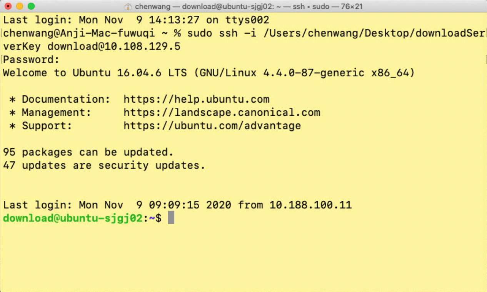
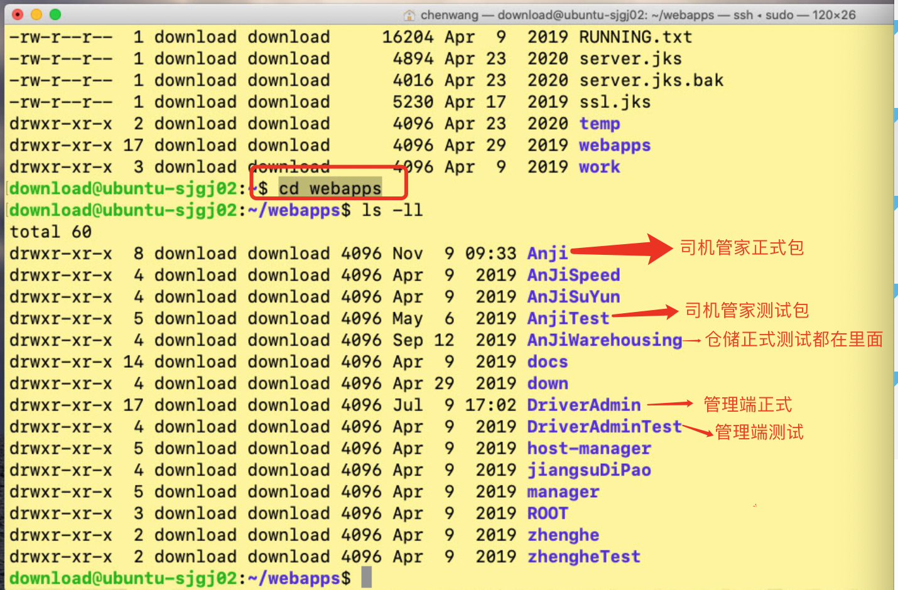

# 安吉服务器连接教程

#### 1. 首先连上安吉跳板机

连接步骤请查阅`《安吉跳板机使用教程》`

#### 2.打开终端输入命令

登录上跳板机后，操作跳板机打开终端2

```
sudo ssh -i /Users/chenwang/Desktop/downloadServerKey download@10.108.129.5
```

其中`/Users/chenwang/Desktop/downloadServerKey`是`downloadServerKey`文件所在的路径，如果此文件路径发生变化，这里需要修改。

#### 3.输入命令行后，提示需要输入密码

密码就是登录跳板机时使用的密码。显示如下样子就表示连接成功了。



#### 4. cd到webapps目录

目录结构说明见下图：



#### 5. 跳板机与服务器之间文件传输

无论是将跳板机中的文件上传到服务器，还是从服务器上下载文件到到跳板机。都是使用`scp`命令。

以上传一张图片到服务器为例子：

```
sudo scp -i /Users/chenwang/Desktop/downloadServerKey /Users/chenwang/Desktop/AnJiSiJiGuanJia512x512.png download@10.108.129.5:/data/applicationDownloadServer/webapps/Anji
```

> 说明
>
> 1. `sudo scp -i /Users/chenwang/Desktop/downloadServerKey`是固定写法
> 2. `/Users/chenwang/Desktop/AnJiSiJiGuanJia512x512.png`是图片路径
> 3. `download@10.108.129.5:/data/applicationDownloadServer/webapps/Anji`是需要上传到服务器的目录地址

如果需要从服务器上下载文件到跳板机，只要互换2和3顺序就可以，比如下载服务器的图片到跳板机

```
sudo scp -i /Users/chenwang/Desktop/downloadServerKey download@10.108.129.5:/data/applicationDownloadServer/webapps/Anji/AnJiSiJiGuanJia512x512.png /Users/chenwang/Desktop
```

