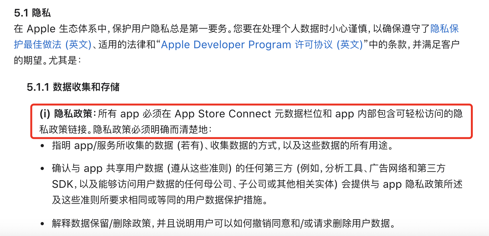

# 上架App Store项目修改需求调研

## 1. 前言

全文内容参考来自苹果官方网站[《App Store 审核指南》](https://developer.apple.com/cn/app-store/review/guidelines/#developer-information)

## 2. 移动端修改需求

### 2.1 新增联系我们页面

移动端需要新增一个`联系我们/关于我们`的页面，用来展示一些官方信息。比如：开发版权、联系邮箱、联系电话等。

> 参考[《App Store 审核指南》](https://developer.apple.com/cn/app-store/review/guidelines/#developer-information)第1.5条协议，附截图如下：
>
> 

### 2.2 确定App分类

需要确定好`司机管家司机端`、`司机管家管理端`、`WMS仓储`三个应用的分类，具体可参考苹果官方文档[《App Store 类别定义》](https://developer.apple.com/cn/app-store/categories/)。

>  参考[《App Store 审核指南》](https://developer.apple.com/cn/app-store/review/guidelines/#developer-information)第2.3.5条协议，附截图如下：

### 2.3 位置等权限使用时需要提醒给用户提示

App需要添加一些提示语，关于持续后台获取定位：审核时最好写上需求说明，以防审核被拒。

> 参考[《App Store 审核指南》](https://developer.apple.com/cn/app-store/review/guidelines/#developer-information)第2.5.4条协议，附截图如下：
>
> 

### 2.4 添加隐私协议

App需要添加隐私协议入口，并展示给用户。

>参考[《App Store 审核指南》](https://developer.apple.com/cn/app-store/review/guidelines/#developer-information)第5.1.1条协议，附截图如下：
>
>

### 2.5 需要重新配置一些三方平台的参数

切换Apple账号重新申请`bundle id`后，需要拿新的id去各个平台重新申请相关信息，并更新到项目中。

### 2.6 版本升级逻辑需要修改

上架`App Store`之后，将不在支持之前的`版本判断`和``升级逻辑`。此段逻辑需要修改。

### 2.7 关于人脸识别

>  参考[《App Store 审核指南》](https://developer.apple.com/cn/app-store/review/guidelines/#developer-information)第2.5.13条协议，附截图如下：

个人认为这条应该暂时不用修改，支付宝、微信等app使用的人脸之别都不是系统自带的人脸识别。

## 3. 后端需求修改

### 3.1 支持`https`和`IPv6`

> 参考[《App Store 审核指南》](https://developer.apple.com/cn/app-store/review/guidelines/#developer-information)第2.5.5条协议，附截图如下：
>
> 

### 3.2 需要提供可以登录的测试账号

需要提供账号供苹果审核人员登录，以便操作App。为了不暴露正式数据，后端需要准备一些专供测试用的账号数据。