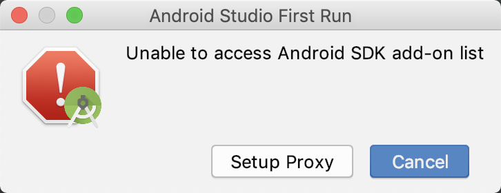

mac Unable to access Android SDK add-on list

最近从Windows转手到了Mac，Mac中第一次使用Android Studio也和在Windows中一样出现了unable to access android sdk add-on list的问题。当然了解决方法也是Windows中的相同：打开bin\idea.properties这个文件，末尾添加一行disable.android.first.run=true就行了。

 

但是，现在有个问题就是对于刚刚入手mac的我来说，首要的问题是怎么找到bin\idea.properties这个文件。折腾了半天，最后终于找到了：打开Finder --> 在左侧的列表中点击应用程序 --> 然后会在右侧的程序列表中看到已经安装的AndroidStudio --> 右键AndroidStudio的图标 --> 选择显示包内容 --> 会看到一个Contents文件夹 --> 进入Contents文件夹 --> 就会看到bin文件夹了 --> 后面的步骤就是进入bin文件夹然后修改ieda文件了，不再赘述了。 （打开idea.properties时我用的CotEditor这个软件，个人觉得这个软件还是挺好用的）

做难事必有所得