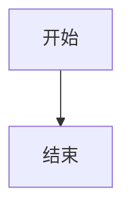
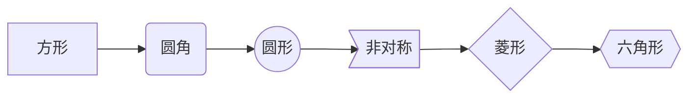
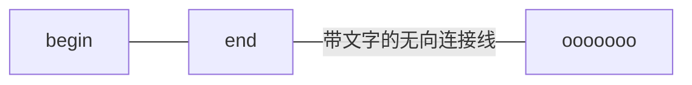
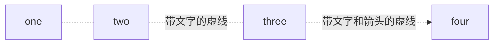
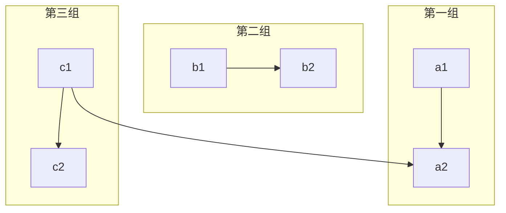
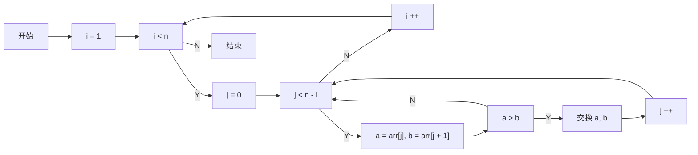

[TOC]
## 流程图语法

### 1、创建流程图模块
语法如下：
```markdown
​```mermaid

​```
```

### 2、流程图方向
| 标志 | 方向                  |
| :--- | :-------------------- |
| TB   | top bottom - 从上到下 |
| BT   | bottom top - 从下到上 |
| RL   | right left - 从右到左 |
| LR   | left right - 从左到右 |
| TD   | 等同于 TB             |
创建一个从上到下流程图语法如下：
```markdown
​```mermaid
graph TB
	1[开始] --> 2[结束]
​```
```



### 3、流程块形状样式
```markdown
​```mermaid
graph LR
	1[方形] --> 2(圆角) --> 3((圆形)) --> 4>非对称] --> 5{菱形} --> 6{{六角形}}
​```
```

```markdown
​```mermaid
graph LR
	1[\平行四边形\] --> 2[/平行四边形/] --> 3[/梯形\] --> 4[\梯形/]
​```
```


### 4、连接线样式

> 样式的含义：
>
> * 有箭头：一般指数据流方向
> * 无箭头：仅表示相关性
> * 实线：强关联
> * 虚线：弱关联

#### 4.1、箭头样式

```markdown
​```mermaid
graph LR
	1[开始] --> 2[结束]
​```
```


#### 4.2、无向线段连接线

```markdown
​```mermaid
graph LR
	1[begin] --- 2[end] -- 带文字的无向连接线 --- 3[ooooooo] 
​```
```



#### 4.3、点状链接线（虚线）

```mariadb
​```mermaid
graph LR
	1[one] -.- 2[two] -.带文字的虚线.- 3[three] -.带文字和箭头的虚线.-> 4[four]
​```
```



#### 4.4、加粗线条

```markdown
​```mermaid
graph LR
	1[one] === 2[two] == 带文字粗箭头 ==> 3[three]
​```
```


### 5、分组

~~~markdown

~~~


###  6、实例

```markdown
​```mermaid
graph LR
	执行1[i = 1]
  执行2[j = 0]
  执行3[i ++]
  执行4["a = arr[j], b = arr[j + 1]"]
  执行5[交换 a, b]
  执行6[j ++]
	判断1["i < n"]
	判断2["j < n - i"]
  判断3["a > b"]
  开始 --> 执行1
  执行1 --> 判断1
  判断1 --Y--> 执行2
  执行2 --> 判断2
  判断2 --Y--> 执行4
  判断2 --N--> 执行3
  执行3 --> 判断1
  执行4 --> 判断3
  判断3 --N--> 判断2
  判断3 --Y--> 执行5
  执行5 --> 执行6
  执行6 --> 判断2
  判断1 --N--> 结束
​```
```




